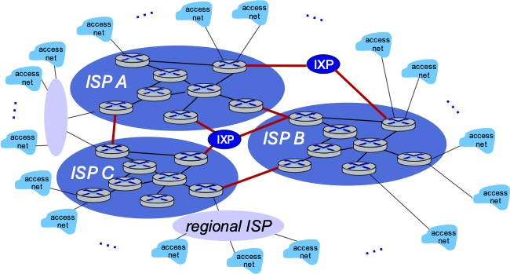

# intro {visibility="hidden"}

# networking

### networking: enable machine-to-machine communication {.smaller}

- goal: enable _applications_ that span multiple computers
  - websites
  - streaming video
  - email
  - chat
  - ...

- challenge: realities of the real-world
  - massive scale
  - consequences of success
  - security
  - geopolitical and economic concerns

# sockets {visibility="hidden"}

### sockets is the de-facto API for networking 

* open <i>connection</i> then … 

   * read+write just like a terminal file
 

* doesn't look like individual messages
* ‘‘connection abstraction’’

# mailbox model {visibility="hidden"}



# review: connection abstraction {visibility="hidden"}



# layers preview {visibility="hidden"}



## layer wrapping {visibility="hidden"}



# handling network failures {visibility="hidden"}

### reality: you don't own the network! 

* the internet is a series of connected networks
* packets traverse routers within and between networks
* those networks provide ‘‘best-effort’’ service
 

 
{}
 



## acknowledgments {visibility="hidden"}



## exercise: lost acks{visibility="hidden"}



## solution: lost acks{visibility="hidden"}



## delayed acks{visibility="hidden"}



## splitting into multiple {visibility="hidden"}



## checksums {visibility="hidden"}



## aside: going faster {visibility="hidden"}



# addresses versus names {visibility="hidden"}





# IP {visibility="hidden"}



## IPv4 addresses {visibility="hidden"}



## IPv6 addresses {visibility="hidden"}



## routing idea {visibility="hidden"}



# lab API {visibility="hidden"}



# UDP v TCP {visibility="hidden"}



# layers, revisited {visibility="hidden"}

## port numbers {visibility="hidden"}



## OS tracking connections {visibility="hidden"}



# DNS {visibility="hidden"}

### againframe(nameAndAddr)



## URLs and URIs {visibility="hidden"}



## HTTP {visibility="hidden"}



# NAT {visibility="hidden"}


